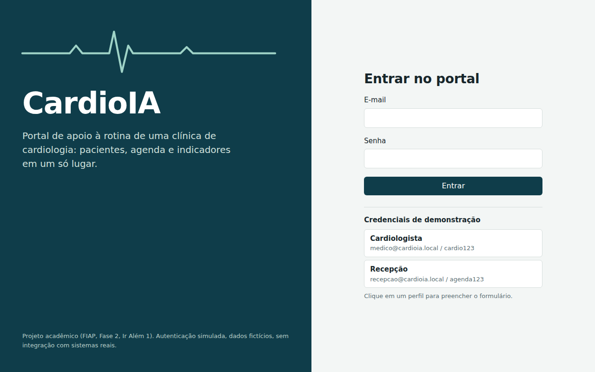
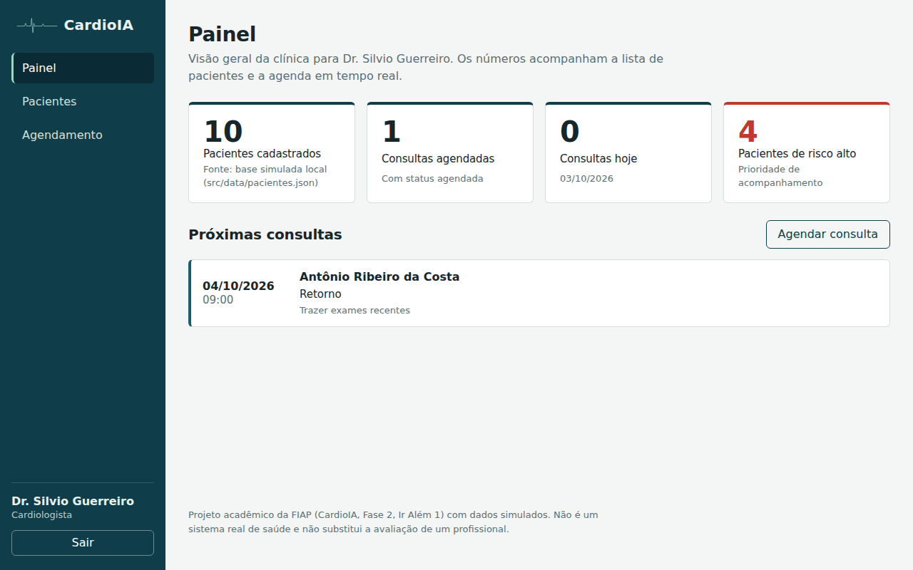
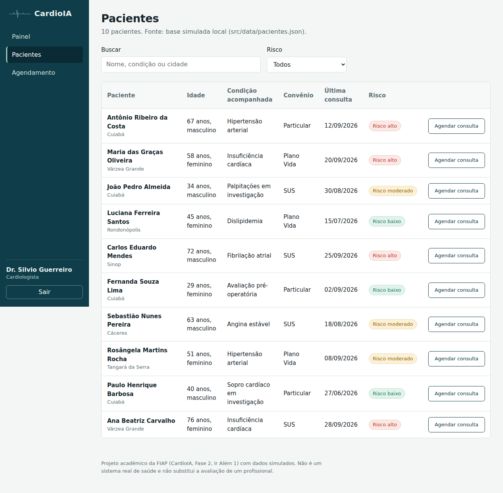
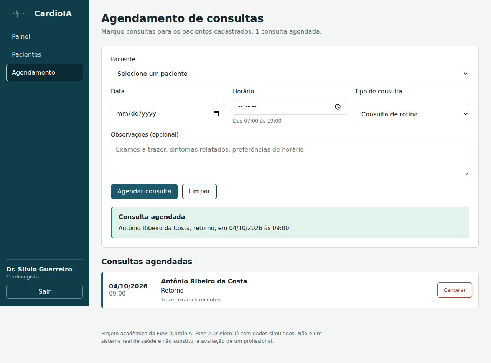
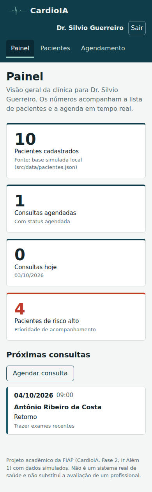
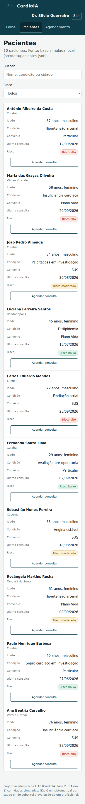

# FIAP - Faculdade de Informática e Administração Paulista

<p align="center">
<a href= "https://www.fiap.com.br/"></a>
</p>

<br>

# CardioIA Portal: interface do CardioIA em React + Vite (Fase 2, Ir Além 1)

## Grupo 69

## 👨‍🎓 Integrantes: 
- <a href="https://www.linkedin.com/in/silvio-guerreiro">Silvio Prestes Guerreiro Junior, RM567958</a>

## 👩‍🏫 Professores:
### Tutor(a) 
- <a href="https://www.linkedin.com/in/leonardoorabona">Leonardo Ruiz Orabona</a>
### Coordenador(a)
- <a href="https://www.linkedin.com/company/inova-fusca">André Godoi Chiovato</a>

## 🎥 Vídeo de demonstração

**Link (YouTube, não listado, até 4 minutos):** [A INSERIR APÓS A PUBLICAÇÃO]

## 📜 Descrição

Portal responsivo que simula, de forma visual, a rotina de um portal de diagnóstico em cardiologia: autenticação, lista de pacientes, agendamento de consultas e um painel com métricas simples. Não há back-end: a autenticação é simulada com Context API e um JWT falso no `localStorage`, os pacientes vêm de uma API pública de exemplo (JSONPlaceholder) com fallback para uma base JSON local, e as consultas ficam no `localStorage`. O foco é a aplicação dos conceitos de Front-End da fase: Hooks avançados (`useState`, `useEffect`, `useContext`, `useReducer`), Context API, roteamento com rotas protegidas, componentização e estilização responsiva com CSS Modules.

Este repositório é o Ir Além 1 da Fase 2 do projeto CardioIA. O repositório principal da fase (extração de sintomas e classificador de risco) é [FIAP_2TIAOR_2026_Ano2_Fase2](https://github.com/silvioguerreiro/FIAP_2TIAOR_2026_Ano2_Fase2); o Ir Além 2 (MLP em Keras para ECG) é [grupo69-cardioia-ecg-mlp](https://github.com/silvioguerreiro/grupo69-cardioia-ecg-mlp).

### Requisitos do enunciado e onde estão atendidos

| Requisito | Implementação | Arquivos |
|---|---|---|
| Autenticação simulada via Context API, com JWT fake no `localStorage` | `AuthProvider` guarda a sessão, expõe `entrar` e `sair`, restaura a sessão ao recarregar, sincroniza entre abas e encerra ao expirar; o token tem cabeçalho, payload e assinatura simulada em base64url, com `exp` de 8 horas | `src/contexts/AuthContext.jsx`, `src/services/authService.js`, `src/hooks/useAuth.js` |
| Listagem de pacientes com API fake (JSONPlaceholder) ou base simulada | `listarPacientes` busca `/users` no JSONPlaceholder, converte os registros em pacientes com campos clínicos simulados e, se a API falhar, usa `src/data/pacientes.json`; a origem usada é exibida na tela | `src/services/pacientesService.js`, `src/hooks/usePacientes.js`, `src/pages/PaginaPacientes.jsx` |
| Formulário de agendamento com `useState` e `useReducer` | Os campos do formulário são geridos por `useReducer` (ações `alterar`, `prePreencher`, `limpar`); o feedback de interface (erros, confirmação, envio) por `useState`; a lista de consultas vive em outro `useReducer` no `AgendaProvider` | `src/components/FormularioAgendamento.jsx`, `src/contexts/AgendaContext.jsx` |
| Dashboard com contagem de pacientes e consultas agendadas | Quatro indicadores (pacientes, consultas agendadas, consultas hoje, pacientes de risco alto) e a lista das próximas consultas | `src/pages/PaginaPainel.jsx`, `src/components/Indicador.jsx` |
| Proteção de rotas com `AuthContext` | `RotaProtegida` redireciona para `/login` quem não tem sessão e devolve o usuário à rota pretendida após autenticar | `src/components/RotaProtegida.jsx`, `src/App.jsx` |
| Estilização com CSS Modules ou Styled Components | CSS Modules por componente e página, tokens globais em `src/styles/global.css`, layout com navegação lateral no desktop e barra superior no celular, tabela que vira cartões em telas estreitas | `src/**/*.module.css` |
| Pastas `/contexts`, `/components`, `/services`, `/pages` | Presentes em `src/`, mais `hooks/`, `data/` e `styles/` | estrutura abaixo |

### Critérios de avaliação

| Critério | Como foi atendido |
|---|---|
| Autenticação funcional e proteção de rotas | Login com validação de credenciais e latência simulada, mensagem de erro clara, sessão persistente, logout, rotas protegidas com retorno à rota pretendida; verificado por teste automatizado |
| Consumo de API e controle de estado | `fetch` assíncrono com `AbortController`, tempo limite, estados de carregamento, erro e origem dos dados; estado global por Context API e `useReducer`, estado local por `useState` |
| Uso correto de Hooks (`useState`, `useEffect`, `useContext`) | `useEffect` para carregar dados com cancelamento, persistir a agenda, sincronizar a sessão e pré-preencher o formulário; `useContext` encapsulado nos hooks `useAuth` e `useAgenda`; `useMemo` e `useCallback` para valores e funções estáveis |
| Componentização e organização | Componentes pequenos e reutilizáveis (`Indicador`, `SeloRisco`, `Mensagem`, `TabelaPacientes`, `ListaConsultas`, `FormularioAgendamento`, `Layout`, `RotaProtegida`, `TracoEcg`), páginas finas, serviços isolados, hooks customizados |
| Estilização responsiva e usabilidade | Tokens de design, uma família tipográfica, foco visível no teclado, `prefers-reduced-motion` respeitado, rótulos em todos os campos, mensagens de erro e de estado vazio que dizem o que fazer, layout sem rolagem horizontal em 390 px (verificado) |

## 📸 Capturas de tela

| Login | Painel |
|---|---|
|  |  |

| Pacientes | Agendamento |
|---|---|
|  |  |

| Painel no celular | Pacientes no celular |
|---|---|
|  |  |

As capturas foram geradas pelo teste automatizado em um ambiente sem acesso à internet, por isso mostram a origem "base simulada local"; com acesso à rede, a lista vem do JSONPlaceholder.

## 📁 Estrutura de pastas

Dentre os arquivos e pastas presentes na raiz do projeto, definem-se:

- <b>.github</b>: arquivos de configuração específicos do GitHub (modelo de relato de problemas do repositório).

- <b>assets</b>: elementos não estruturados do repositório, como imagens; aqui, o logo institucional.

- <b>document</b>: documentos do projeto; aqui, as capturas de tela geradas pelo teste automatizado, usadas neste README.

- <b>public</b>: arquivos estáticos servidos pelo Vite sem processamento (ícone do site).

- <b>scripts</b>: scripts auxiliares; aqui, o teste de fumaça de ponta a ponta com Playwright, executado por `npm run test:e2e`.

- <b>src</b>: todo o código-fonte da aplicação, com as pastas exigidas pelo enunciado (`contexts`, `components`, `services`, `pages`) e mais `hooks`, `data` e `styles`.

- <b>index.html, package.json, package-lock.json e vite.config.js</b>: ponto de entrada e configuração do projeto. O Vite e o npm exigem esses arquivos na raiz, por isso não há a pasta `config` do modelo FIAP.

- <b>README.md</b>: arquivo que serve como guia e explicação geral sobre o projeto (o mesmo que você está lendo agora).

```
FIAP_2TIAOR_2026_Ano2_Fase2_Ir_Alem_1_Grupo69_cardioia-portal/
├── .github/
│   └── problem-report.md              # modelo de relato de problemas (modelo FIAP)
├── .gitattributes                     # normalização de fim de linha
├── .gitignore                         # exclui node_modules e dist
├── LICENSE
├── README.md
├── index.html                         # ponto de entrada do Vite
├── package.json                       # scripts e dependências
├── package-lock.json                  # versões resolvidas das dependências
├── vite.config.js
├── assets/logo-fiap.png
├── public/favicon.svg
├── document/
│   └── capturas/                      # capturas de tela geradas pelo teste
├── scripts/
│   └── teste_fumaca.mjs               # teste de ponta a ponta com Playwright
└── src/
    ├── main.jsx                       # provedores (Auth, Agenda) e roteador
    ├── App.jsx                        # rotas públicas e protegidas
    ├── contexts/
    │   ├── AuthContext.jsx            # sessão, entrar, sair (Context API)
    │   └── AgendaContext.jsx          # consultas com useReducer e persistência
    ├── hooks/
    │   ├── useAuth.js
    │   ├── useAgenda.js
    │   └── usePacientes.js            # fetch com carregamento, erro e cancelamento
    ├── services/
    │   ├── authService.js             # JWT falso, credenciais de demonstração
    │   ├── pacientesService.js        # JSONPlaceholder com fallback local
    │   └── agendaService.js           # persistência no localStorage e utilitários de data
    ├── components/
    │   ├── Layout.jsx                 # navegação lateral/superior e rodapé
    │   ├── RotaProtegida.jsx
    │   ├── FormularioAgendamento.jsx  # useState + useReducer
    │   ├── ListaConsultas.jsx
    │   ├── TabelaPacientes.jsx        # tabela no desktop, cartões no celular
    │   ├── Indicador.jsx
    │   ├── SeloRisco.jsx
    │   ├── Mensagem.jsx               # carregando, erro, sucesso, vazio
    │   ├── TracoEcg.jsx               # marca visual (traçado de ECG)
    │   └── *.module.css               # estilos CSS Modules de cada componente
    ├── pages/
    │   ├── PaginaLogin.jsx
    │   ├── PaginaPainel.jsx
    │   ├── PaginaPacientes.jsx
    │   ├── PaginaAgendamento.jsx
    │   ├── PaginaNaoEncontrada.jsx
    │   └── *.module.css               # estilos CSS Modules das páginas
    ├── data/
    │   ├── usuarios.json              # credenciais de demonstração
    │   └── pacientes.json             # base simulada de pacientes (fallback)
    └── styles/global.css              # tokens de design e estilos base
```

## 🔧 Como executar o código

**Pré-requisitos:** Node.js 18 ou superior (testado com Node 22) e npm. Nenhum serviço externo é obrigatório: sem internet, a lista de pacientes vem da base local.

```bash
# 1. Clonar o repositório
git clone https://github.com/silvioguerreiro/FIAP_2TIAOR_2026_Ano2_Fase2_Ir_Alem_1_Grupo69_cardioia-portal.git
cd FIAP_2TIAOR_2026_Ano2_Fase2_Ir_Alem_1_Grupo69_cardioia-portal

# 2. Instalar as dependências
npm install

# 3. Executar em modo de desenvolvimento (abre em http://localhost:5173)
npm run dev

# 4. Gerar o build de produção e visualizá-lo (http://localhost:4173)
npm run build
npm run preview
```

Credenciais de demonstração (também exibidas na tela de login):

| Perfil | E-mail | Senha |
|---|---|---|
| Cardiologista | medico@cardioia.local | cardio123 |
| Recepção | recepcao@cardioia.local | agenda123 |

### Teste automatizado

O teste de fumaça percorre o fluxo completo no build de produção: redirecionamento de rota protegida, erro de credencial, login com retorno à rota pretendida, token no `localStorage`, lista de pacientes, busca, pré-preenchimento do agendamento a partir da lista, validação, agendamento, conflito de horário, contagem no painel, persistência após recarregar, layout no celular sem rolagem horizontal, logout e nova proteção das rotas. Ele também grava as capturas de `document/capturas/`.

```bash
npm run build
npx playwright install chromium   # apenas na primeira vez
npm run test:e2e
```

## ⚙️ Decisões técnicas

- **JWT falso com estrutura real.** O token tem cabeçalho (`alg: none`), payload (`sub`, `nome`, `perfil`, `iat`, `exp`) e uma assinatura ilustrativa. Não há verificação criptográfica, o que é dito explicitamente no código: a finalidade é demonstrar o ciclo de vida da sessão, não segurança.
- **Dois reducers com papéis distintos.** O reducer do formulário trata campos e limpeza; o reducer da agenda trata a lista de consultas (`agendar`, `cancelar`, `restaurar`). Separar os dois evita que a interface do formulário dependa da estrutura da agenda.
- **Fallback de dados declarado.** Quando o JSONPlaceholder não responde, o serviço usa a base local e a interface informa a origem. O usuário nunca vê uma lista vazia sem explicação.
- **Responsividade sem duplicar markup.** A tabela de pacientes é a mesma no desktop e no celular; o CSS transforma linhas em cartões usando `data-rotulo` para os nomes das colunas.
- **Acessibilidade de base.** Rótulos associados aos campos, foco visível, mensagens com `role="alert"` ou `role="status"`, cores de risco sempre acompanhadas de texto, animação do traçado desativada com `prefers-reduced-motion`.

## 🧭 Limitações e próximos passos

- Sem back-end: dados de consultas ficam no navegador e não são compartilhados entre dispositivos.
- Autenticação apenas demonstrativa; em produção exigiria servidor de identidade, tokens assinados, renovação e controle de acesso por perfil.
- Pacientes do JSONPlaceholder recebem campos clínicos simulados de forma determinística; nenhum dado corresponde a pessoa real.
- Próximos passos no CardioIA: conectar o portal ao módulo de triagem da Fase 2 (extração de sintomas e classificador de risco) e, na Fase 3, aos sinais dos dispositivos vestíveis.

## 🗃 Histórico de lançamentos

* 0.2.0 - 03/10/2026
    * Reorganização na estrutura do modelo FIAP (`.github`, `assets`, `document`, `scripts`, `src`) e atualização do grupo.
* 0.1.0 - 02/10/2026
    * Primeira versão do portal: autenticação simulada, pacientes, agendamento, painel, rotas protegidas, CSS Modules responsivo e teste de fumaça.

## 📚 Referências

- FIAP. **Interfaces inteligentes: conectando IA ao usuário com React e JWT**. Capítulo 5 do material didático da Fase 2, 2º ano, curso de Inteligência Artificial. São Paulo: FIAP, 2025.
- META. **React: documentação oficial**. Disponível em: https://react.dev/. Acesso em: 2 out. 2026.
- REMIX SOFTWARE. **React Router: documentação oficial**. Disponível em: https://reactrouter.com/. Acesso em: 2 out. 2026.
- VITE. **Vite: documentação oficial**. Disponível em: https://vite.dev/. Acesso em: 2 out. 2026.
- TYPICODE. **JSONPlaceholder: free fake API for testing and prototyping**. Disponível em: https://jsonplaceholder.typicode.com/. Acesso em: 2 out. 2026.

## 📋 Licença

Código sob licença MIT (arquivo [`LICENSE`](LICENSE)).

<p xmlns:cc="http://creativecommons.org/ns#" xmlns:dct="http://purl.org/dc/terms/"><a property="dct:title" rel="cc:attributionURL" href="https://github.com/agodoi/template">MODELO GIT FIAP</a> por <a rel="cc:attributionURL dct:creator" property="cc:attributionName" href="https://fiap.com.br">Fiap</a> está licenciado sobre <a href="http://creativecommons.org/licenses/by/4.0/?ref=chooser-v1" target="_blank" rel="license noopener noreferrer" style="display:inline-block;">Attribution 4.0 International</a>.</p>

## ⚠️ Aviso

Projeto acadêmico com dados simulados. Não é um sistema real de saúde, não armazena dados de pacientes reais e não substitui a avaliação de um profissional.
